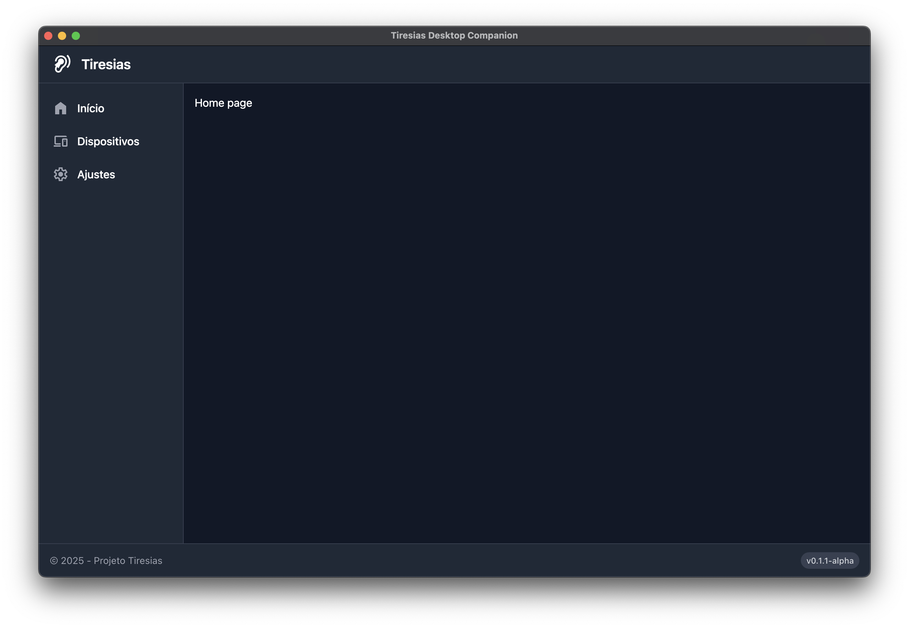

# Tiresias Desktop Companion



## 📱 Introduction

Welcome to the Tiresias Desktop Companion! This application is part of the Tiresias Project, a Brazilian research initiative conducted at EESC-USP (São Carlos School of Engineering at the University of São Paulo) by MSc students. The goal of the Tiresias Project is to develop a free and open-source national technology for hearing aid applications using off-the-shelf components.

This desktop application allows you to connect to and manage Tiresias hearing aid devices via Bluetooth Low Energy (BLE).

## 🎯 Project Overview

### About the Tiresias Project

The Tiresias Project is an innovative effort to create an open-source and accessible hearing aid solution tailored to the needs of the Brazilian population. Our aim is to reduce dependency on expensive proprietary technologies by leveraging widely available components and state-of-the-art design practices.

### Key Features

- **Connectivity**: Utilizes Bluetooth Low Energy (BLE) for seamless wireless communication with Tiresias hearing aid devices
- **Device Management**: Scan, connect, and manage your Tiresias hearing aid devices
- **User-Friendly Interface**: Simple and intuitive interface for all users
- **Cross-Platform**: Works on Windows, macOS, and Linux
- **Open-Source**: All code is open-source, allowing for community collaboration and transparency

## 🚀 Getting Started

### Prerequisites

- [Node.js](https://nodejs.org/) (version 24.4.1 or higher)
- npm (comes with Node.js)

### Installation

1. Clone this repository:
   ```sh
   git clone https://github.com/felipepimentab/tiresias-desktop.git
   cd tiresias-desktop
   ```

2. Install dependencies:
   ```sh
   npm install
   ```

#### Linux System Dependencies

On Linux systems, you'll need to install the `libudev-dev` package before running `npm install` to compile the USB module used for Bluetooth functionality:

```sh
sudo apt-get update && sudo apt-get install -y libudev-dev
```

### Running the Application

Start the application in development mode with hot-reload:

```sh
npm start
```

## 🛠️ Development

### Available Scripts

```sh
npm run build
```
Runs the `build` command in all workspaces if present.

```sh
npm run compile
```
First runs the `build` script, then compiles the project into an executable using `electron-builder` with the specified configuration.

```sh
npm run compile -- --dir -c.asar=false
```
Same as `npm run compile` but passes additional parameters to `electron-builder` to disable asar archive and installer creation. Useful for debugging the compiled application.

```sh
npm run test
```
Executes end-to-end tests on the **compiled app** using Playwright.

```sh
npm run typecheck
```
Runs the `typecheck` command in all workspaces if present.

## 📚 Project Structure

The project uses a workspace-based structure:

- `packages/main`: Electron main process code
- `packages/preload`: Preload scripts for secure renderer-to-main communication
- `packages/renderer`: Vue.js-based UI application

## 🤝 Contributing

Contributions are welcome! Please see [CONTRIBUTING.md](CONTRIBUTING.md) for details on how to contribute to this project.

## 📝 License

This project is licensed under the MIT License - see the LICENSE file for details.

## 📮 Acknowledgments

- EESC-USP: For providing the infrastructure and support for this research
- The Tiresias Project team: For their work on the hearing aid hardware and firmware

## 📞 Contact

For more information about the Tiresias Project, visit [the documentation website](https://tiresias-docs.vercel.app).
